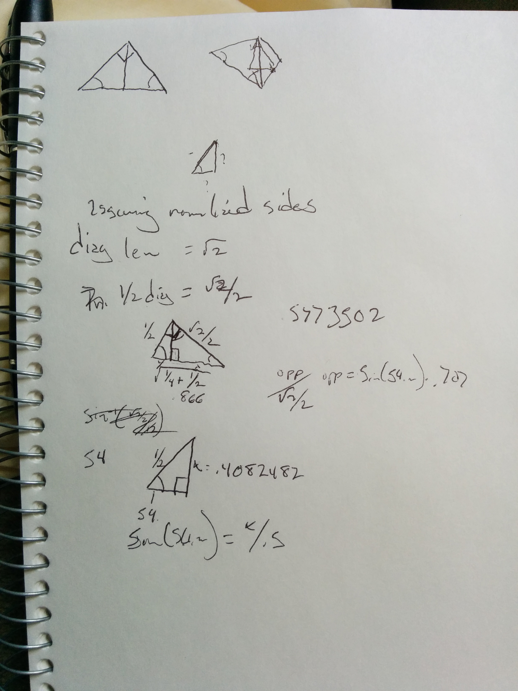

# FTPyramidImageThing
A projection of an image such that when printed and folded into a pyramid you get the original image back.

Assuming sides of length 1, the height of your pyramid is 0.40824829042.

I have to figure this out so that I can build a precise set of triangles for the program.

Next up is figuring out where each vertex sits assuming the center vertex is 0,0,.4082).

A circle that precisely inscribes the base of the pyramid would have radius 0.57735026913.

So, given that information I can build and rotate the triangle easily given a rotation, xy 0ffset, and scale.  
All I need to do now is write the algorithm that, for each dest pixel does what we talked about 
(figures out where on the 3d tri it will be, then does a projection to get the relative U,V coords).

I guess having projection settings would help also, so you could do both perspective and orthographic.

Then you could also set it up such that the object had arbitrary transforms; not just point on...